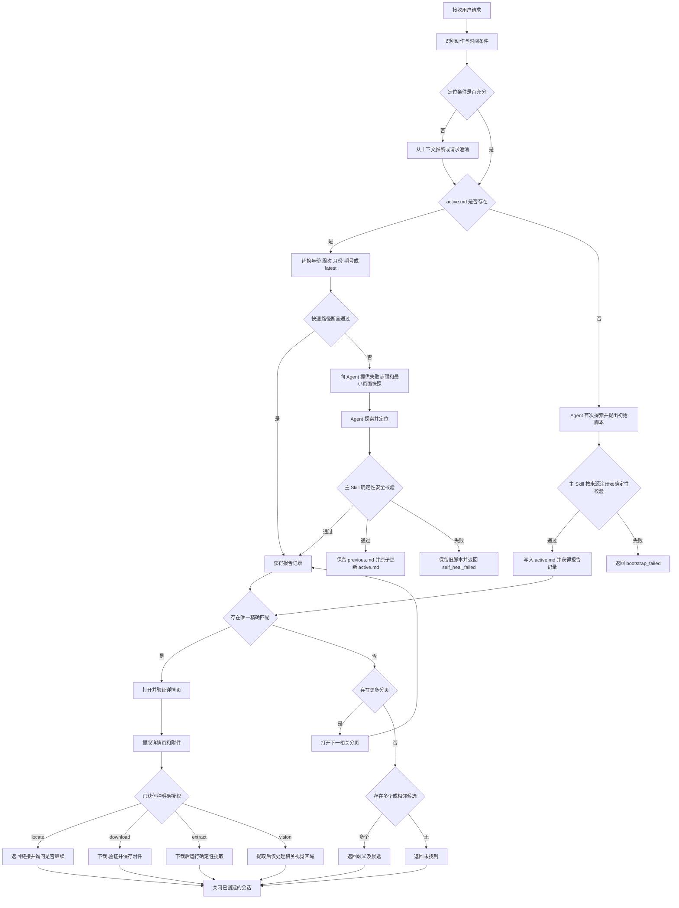
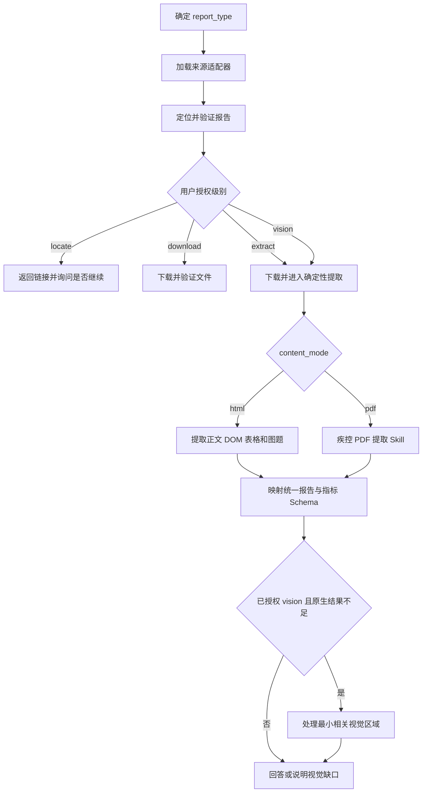
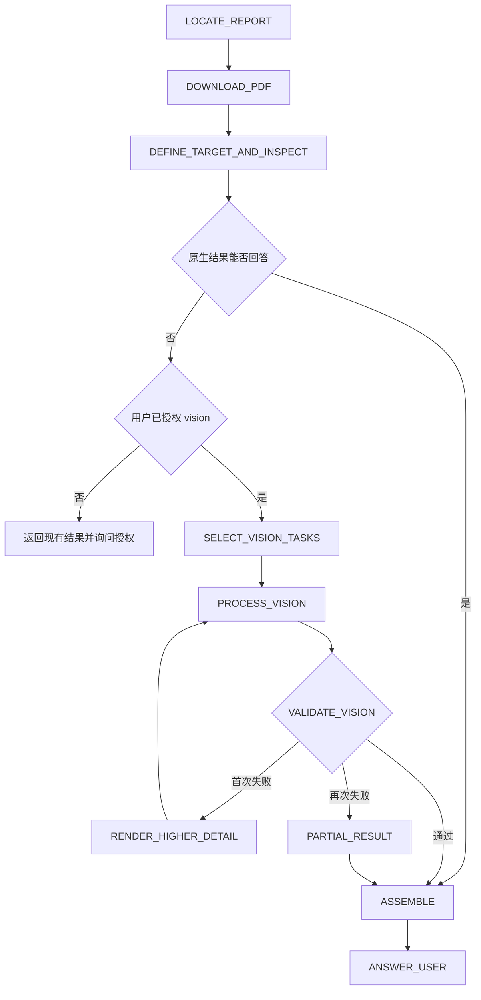
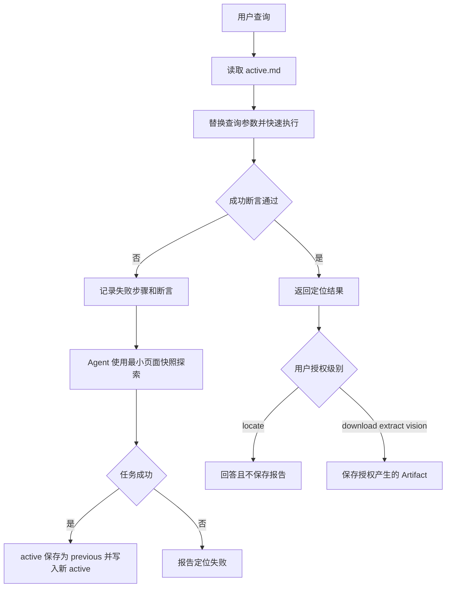

# 中国疾控健康监测报告检索与解析 Skill 产品需求文档

## 1. 文档信息

| 字段 | 内容 |
|---|---|
| 产品名称 | Find China CDC Health Report |
| Skill 名称 | `find-china-cdc-health-report` |
| 文档类型 | 产品需求文档（PRD） |
| 文档版本 | v1.7 |
| 状态 | 待评审 |
| 创建日期 | 2026-07-22 |
| 最近更新 | 2026-07-22 |
| 主要数据源 | 中国疾病预防控制中心健康数据栏目及其官方报告 |
| 仓库迁移要求 | 当前目录名仍为 `find-china-flu-weekly-report`；首次实现提交前迁移为 `find-china-cdc-health-report` |

## 2. 背景

中国疾病预防控制中心持续发布流感、急性呼吸道传染病、新型冠状病毒感染和全球传染病风险评估等健康监测报告。用户通常以报告类型、年份、周次、月份、期号、发布日期或“最新一期”等自然语言方式查找报告，但不同栏目在发布周期和载体上并不统一：既有周度 PDF、周度 HTML、月度 HTML，也有栏目直接链接 PDF 的月度报告。

人工查找存在以下问题：

1. 用户表达与网站字段不完全一致，例如“2025-05-15 那周”既可能指发布日期，也可能指该日期所属监测周。
2. 报告年份、监测周、报告月份、期号、发布日期和网页入库日期是不同概念，跨年或跨月时尤其容易误判。
3. 同一周可能存在多种报告，只给出周次无法唯一确定报告类型。
4. 月度报告正文可能包含多个周次的数据，报告周期不能与数据周期混为一谈。
5. 历史报告位于多个分页，无法只搜索栏目首页。
6. 报告可能是 HTML、直接 PDF 或详情页加附件，提取流程不能硬编码为单一形态。
7. 浏览器会话、反自动化响应、网站结构或网络故障可能被错误解释为“报告不存在”。
8. 对同一来源重复探索页面、下载报告和解析内容会浪费时间、网络、算力和模型 Token。
9. 页面结构变化通常只能在执行失败后发现，缺少可比较的上次成功结构与自愈上下文。
10. 用户此前获取的原始报告和解析结果如果没有本地留存，后续查询会重复抓取和处理相同数据。

因此，需要设计一个以报告定位为核心的 Codex Skill：用来源注册表管理栏目，用参数化 agent-browser 脚本复用相似查询，只替换年份、周次、月份、期号或 `latest`。默认止于返回已验证链接；下载、疾控 PDF 提取 Skill 和 Agent 视觉处理按成本与副作用逐级获得用户授权。

## 3. 产品目标

### 3.1 核心目标

用户通过自然语言指定报告类型、某一周、某个月、某一期、某个发布日期或“最新一期”后，Skill 能够：

1. 准确理解并标准化查询条件。
2. 从已登记的中国疾控中心官网栏目检索报告。
3. 找到唯一匹配的 HTML 报告、详情页或直接 PDF。
4. 返回详情页、文档 URL 及可用附件链接，默认不下载文件。
5. 只有获得用户明确授权后，才依次执行下载、疾控 PDF 提取 Skill 或 Agent 视觉处理。
6. 在无结果、结果歧义或技术故障时给出明确、可操作的说明。
7. 把成功的 agent-browser 操作提炼为参数化脚本；相同来源再次查询时只替换年份、周次、月份、期号或 `latest` 参数。
8. 参数化脚本失败时，将失败步骤和当前页面的最小相关结构交给 Agent 探索；成功后更新脚本并保留一个可回退版本。
9. 在用户授权内容提取时，以低安装成本提取 HTML 或 PDF 中的文字和原生表格；视觉处理必须再次获得明确授权。
10. 保存用户明确要求下载的源文件和明确要求生成的解析结果，不把“定位成功”自动扩展为本地数据留存。

### 3.2 成功标准

- 在 `references/test-cases.md` 冻结的至少 50 条 MVP 回归用例上，报告定位 Top-1 命中率不低于 95%。
- 在冻结回归集的精确期号用例上，命中率为 100%。
- `source_unavailable` 被误判为 `not_found` 的次数为 0。
- 不将浏览器或网站故障误报为“报告不存在”。
- 不用发布日期年份替代报告所属年份。
- 不将近似匹配结果冒充精确匹配结果。
- 每个成功结果均包含可追溯的官网 `detail_url` 或 `document_url`。
- 对存在附件的报告，能够识别并返回附件 URL 和类型。
- 默认操作止于报告定位；下载、PDF 提取和 Agent 视觉处理均不得被隐式触发。
- PDF 提取 Skill 通过轻量证据结果记录原生证据、未解决项和视觉缺口。
- 不把月报正文中的周次误判为报告自身的发布周期。
- 不在统计口径不一致时直接合并或比较同名指标。
- 在 `references/test-cases.md` 标记为 `fast_path` 的不少于 20 条回归用例上，页面结构未变化时参数化脚本成功率不低于 90%。
- 快速路径失败时必须指出失败步骤并进入 Agent 探索，不得把失败结果冒充命中。
- 脚本不得保存 `@eN`、坐标、Cookie、认证头、浏览器 Profile 或完整 Agent 推理。
- 用户没有明确要求跨期比较时，不获取上一期报告、不建设历史指标序列，也不自行跨报告计算趋势。

## 4. 非目标

首期不包含：

1. 提供一般性的疾病诊断、治疗或医学建议。
2. 检索来源注册表之外的第三方或未登记报告栏目。
3. 对报告中的流行病学指标做自动预测或趋势外推。
4. 绕过登录、验证码、访问控制或网站安全策略。
5. 建设独立的长期报告数据库或搜索服务。
6. 保证第三方转载内容与官网完全一致。
7. 在未建立指标口径映射时，自动合并不同报告中的同名指标。
8. 保存 Cookie、Authorization Header、浏览器 Profile 或其他认证秘密到 Memory/Artifact Store。
9. 保存依赖临时元素编号、坐标或偶然页面状态的浏览器脚本。
10. 把完整历史 HTML、完整缓存或全部解析结果无差别放入 Agent 上下文。
11. 默认下载报告、默认调用 PDF 提取 Skill、默认执行 OCR 或图表视觉分析。
12. 为回答单期报告问题而自动获取上一期报告、维护历史指标库或自行跨期比较。

## 5. 用户与使用场景

### 5.1 目标用户

- 公共卫生研究人员
- 医疗机构工作人员
- 数据分析人员
- 新闻与政策研究人员
- 需要查找官方流感周报的普通用户
- 需要基于周报继续进行 PDF、表格或摘要处理的 AI Agent

### 5.2 典型用户故事

1. 作为研究人员，我希望输入“找 2026 年第 20 周流感报告”，获得唯一的官网报告链接。
2. 作为数据分析人员，我希望输入“下载 2025 年第 35 周周报”，获得并保存官网附件。
3. 作为编辑，我希望输入“流感第 917 期讲了什么”，让系统先定位对应报告；内容总结属于阶段 3，不作为 MVP 发布门槛。
4. 作为普通用户，我希望输入“最新一期流感周报”，获得最新报告的标题、周次、发布日期和链接。
5. 作为研究人员，我希望输入“2025-05-15 那周的流感周报”，系统能区分“发布日期”和“日期所属监测周”，避免选错报告。
6. 作为分析人员，我希望输入“2026 年第 28 周急性呼吸道监测”，获得对应 HTML 报告及表格；该能力属于阶段 1.5。
7. 作为研究人员，我希望查询某月的新冠疫情或全球风险评估；该能力属于阶段 1.5。

## 6. 产品范围

### 6.1 数据源

首期权威栏目入口：

| `report_type` | 报告名称 | 周期 | 内容形态 | 栏目入口 |
|---|---|---|---|---|
| `influenza_weekly` | 中国流感监测周报 | 周度 | 详情页及 PDF | `https://www.chinacdc.cn/jksj/jksj04_14249/` |
| `respiratory_weekly` | 全国急性呼吸道传染病哨点监测情况 | 周度 | HTML 正文、表格及图片 | `https://www.chinacdc.cn/jksj/jksj04_14275/` |
| `covid_monthly` | 全国新型冠状病毒感染疫情情况 | 月度 | HTML 正文及图片 | `https://www.chinacdc.cn/jksj/xgbdyq/` |
| `global_infectious_risk_monthly` | 全球传染病事件风险评估报告 | 月度 | 栏目直接链接 PDF | `https://www.chinacdc.cn/jksj/jksj03/` |

Skill 默认只在以下范围内导航：

- 已登记栏目的首页及其分页；
- 栏目下的 HTML 报告或详情页；
- 详情页或列表直接指向的官方文档及附件。

除非用户明确要求，不使用搜索引擎、第三方转载站或其他非官网数据源替代官网结果。

### 6.2 支持的用户意图

| 意图 | 说明 | 优先级 |
|---|---|---|
| 定位报告 | 返回报告元数据、详情页和附件链接 | P0 |
| 查询最新一期 | 返回官网当前最新报告 | P0 |
| 按报告类型查询 | 识别流感、呼吸道、新冠或全球风险评估 | P0 |
| 按年份和周次查询 | 精确匹配周度报告或包含该周数据的月报 | P0 |
| 按年份和月份查询 | 精确匹配月度新冠或全球风险评估报告 | P0 |
| 按期号查询 | 按“第 N 期”精确匹配 | P0 |
| 按发布日期查询 | 按官网展示的发布日期匹配 | P1 |
| 按自然日期所在周查询 | 将日期转换成候选周后，再用官网标题验证 | P1 |
| 下载附件 | 下载并验证目标附件 | P1 |
| 提取正文 | 从 HTML 或附件中提取内容 | P1 |
| 总结报告 | 基于已提取内容生成摘要 | P2 |
| 批量查询 | 一次查询多个周次或日期范围 | P2 |
| PDF 原生文字提取 | 提取文字、页码、阅读顺序和坐标 | P1 |
| PDF 矢量表格提取 | 保留表头、行列、原始值和解析值 | P1 |
| 扫描页 OCR | 仅将缺少有效文本层的必要区域交给 Agent | P2 |
| 图片表格识别 | 将程序无法还原的表格裁剪后交给 Agent | P2 |
| 图表数据数字化 | 提取明确标注值或给出带误差说明的近似值 | P2 |
| 跨报告指标查询 | 仅在用户明确要求比较多份报告时进入独立后续流程 | P2 |

默认能力边界为 `locate`。四个处理级别及包含关系如下：

```text
vision ⊃ extract ⊃ download ⊃ locate
```

上级授权包含完成该操作所必需的下级动作；未获得上级授权时不得自动升级。用户只表达“想知道数据或趋势”不等于授权下载、PDF 提取或视觉处理，Skill 应先定位报告，再让用户选择下一步。报告中的“趋势”只指本期报告正文或图表已经表达的结论；除非用户明确要求，不进行跨期获取和比较。

## 7. Skill 触发设计

### 7.1 建议名称

```text
find-china-cdc-health-report
```

名称采用小写字母和连字符，短、明确且以动作开头。

### 7.2 应触发的表达

- “找 2026 年第 20 周中国流感监测周报”
- “下载去年第 35 周的流感报告”
- “查第 917 期流感周报”
- “给我最新一期中国疾控中心流感周报”
- “2025-05-15 发布的是哪一期？”
- “总结 2024 年第 52 周流感报告”
- “找 2026 年第 28 周急性呼吸道监测情况”
- “查询 2026 年 6 月全国新冠疫情情况”
- “下载 2026 年 6 月全球传染病风险评估”
- “第 25 周新冠阳性率是多少？”

### 7.3 不应触发的表达

- “流感有哪些症状？”
- “美国本周流感数据如何？”
- “预测下个月流感病例数”
- “查询某省医院内部感染数据”
- “查询未登记的第三方疫情报告”

## 8. 输入规范

### 8.1 标准查询对象

Skill 将自然语言解析为以下概念模型：

| 字段 | 类型 | 必填 | 说明 |
|---|---|---|---|
| `report_type` | 枚举 | 否 | 报告类型；可由用户表达推断 |
| `period_type` | 枚举 | 否 | `week`、`month` 或 `date_range` |
| `period_year` | 整数 | 否 | 报告所属年份，不等于发布日期年份 |
| `period_week` | 1–53 | 否 | 周度报告标题中的周次 |
| `period_month` | 1–12 | 否 | 月度报告标题中的月份 |
| `issue_number` | 正整数 | 否 | 报告标题中的期号 |
| `publish_date` | YYYY-MM-DD | 否 | 官网列表展示的发布日期 |
| `reference_date` | YYYY-MM-DD | 否 | 用户表达的自然日期 |
| `latest` | 布尔值 | 否 | 是否查询最新一期 |
| `action` | 枚举 | 否 | `locate`、`download`、`extract`、`vision` 或 `summarize` |
| `output_format` | 枚举 | 否 | `text` 或 `json` |
| `language` | 枚举 | 否 | `zh` 或 `en` |
| `refresh` | 布尔值 | 否 | 是否强制在线复验来源 |
| `artifact_root` | 绝对路径 | 否 | 用户明确下载或提取时的保存目录；默认 `<skill-root>/artifacts` |

所有字段均可选，但查询必须满足一个 `oneOf` 组合。MVP 支持：

- `report_type=influenza_weekly + period_year + period_week`
- `issue_number`
- `report_type=influenza_weekly + latest=true`

阶段 1.5 增加：

- `report_type + period_year + period_week`
- `report_type + period_year + period_month`
- `report_type + publish_date`
- `report_type + reference_date`

### 8.2 默认值

- `action` 默认值：`locate`
- `output_format` 默认值：`text`
- `language` 默认值：`zh`
- `refresh` 默认值：历史报告为 `false`，“最新一期”为 `true`
- 未指定 `action` 时只执行 `locate`；定位结果不自动写入 Artifact Store。
- 用户请求的动作已明确包含下载、提取或视觉分析时，视为对应级别的显式授权，无需重复询问。
- 用户意图只表达“查看数据”“了解趋势”但未明确授权处理方式时，定位成功后提供 `locate`、`download`、`extract`、`vision` 四个选项并等待选择。
- 用户只给周次、未给报告类型时：检查可能匹配的周度来源；存在多个候选时要求用户选择。
- 用户只给周次、未给年份时：优先从可靠上下文解析；没有可靠上下文时必须要求用户补充年份，不默认当前年份。
- 如果当前年份尚未到达用户指定周次，不自动回退上一年，应请求澄清。

### 8.3 时间语义规则

系统必须区分：

1. **报告类型**：决定数据源、周期、标题解析与内容路由。
2. **报告周期**：周度报告的年/周或月度报告的年/月。
3. **数据周期**：正文指标实际覆盖的周、月或日期范围，可能与报告周期不同。
4. **期号**：仅部分报告具有，例如流感周报中的“第 909 期”。
5. **发布日期**：官网列表展示的日期。
6. **网页 URL 日期**：URL 中的建站或入库日期，仅用于导航，不作为业务匹配依据。

跨年报告必须以标题中的报告年份和周次为准。例如，2024 年第 52 周报告可能在 2025 年 1 月发布。

月度报告正文可能包含多个周次。例如 2026 年 6 月新冠疫情报告包含第 23–26 周数据；这些周次属于 `data_periods`，不应将报告本身识别为“第 26 周报告”。

所有 `publish_date` 均解释为中国标准时间 `Asia/Shanghai` 下的自然日，序列化格式为 `YYYY-MM-DD`，不进行 UTC 日期换算。页面未提供具体时刻时，不得补造时间戳。

## 9. 功能需求

### FR-01：加载运行时指南

每次触发 Skill 后，在首次执行 agent-browser 命令前加载与已安装版本匹配的核心指南。

要求：

- 使用 agent-browser 自带的 `skills get core` 能力；
- 不在本 Skill 中复制完整 agent-browser 文档；
- 若指南无法加载，应报告工具环境异常。

### FR-02：会话隔离

需要浏览器时，每次查询使用独立命名会话，不默认复用 `default` 会话。

要求：

- 会话名应可区分任务；
- 查询结束后关闭会话；
- 不依赖用户的个人 Chrome Profile；
- 不读取或输出用户 Cookie、令牌等敏感信息。

### FR-03：来源选择与栏目访问

Skill 应根据 `report_type` 从来源注册表选择栏目入口并验证：

- 最终 URL 位于预期域名；
- 页面标题或页面内容能够确认是中国疾控中心流感监测周报栏目；
- 页面中存在符合该适配器规则的报告链接或明确的空状态。

来源适配器必须声明 `transport_preference`：

| 值 | 使用条件 |
|---|---|
| `http_first` | 静态列表、静态 HTML 和直接文档的默认策略；HTTP 成功且内容验证通过时不启动浏览器 |
| `browser_first` | 已知依赖浏览器行为、Cookie 或客户端渲染的来源 |
| `browser_required` | 普通 HTTP 已确认不可用且存在稳定浏览器路径的来源 |

HTTP 的成功条件为 2xx、非空响应、内容类型合理且正文/标题验证通过。任一条件失败才回退 agent-browser。`influenza_weekly` MVP 默认使用 `http_first`，但必须验证浏览器回退路径。

### FR-04：列表记录提取

对每条周报提取并标准化：

```text
report_type
period_type
period_year
period_week
period_month
issue_number
publish_date
title
detail_url
document_url
content_mode
source_page_url
```

要求：

- 只处理符合当前来源适配器标题规则的有效链接；
- 将相对 URL 转换为绝对 URL；
- 清理标题中的重复空白；
- 按 `detail_url ?? document_url` 生成 canonical URL，同一 canonical URL 只保留一条；
- 标题解析失败时保留原始标题并标记警告，不得猜测字段。

### FR-05：分页发现

分页数量不得硬编码。

要求：

1. 从栏目首页识别“下一页”“尾页”或数字分页链接；
2. 推导当前最大分页范围；
3. 防止循环访问相同分页；
4. 找到唯一精确匹配后立即停止；
5. 只有在批量或完整目录任务中才遍历所有分页。

### FR-06：按年份和周次匹配周度报告

当用户提供年份和周次时，必须同时精确匹配：

```text
record.period_year == query.period_year
record.period_week == query.period_week
record.report_type == query.report_type
```

不得使用发布日期年份替代报告所属年份。

当用户未指定报告类型且同一周存在多种报告时，返回 `ambiguous` 并列出报告类型候选。

### FR-07：按期号匹配

当用户提供期号时，精确匹配标题中的期号。

期号仅对声明支持 `issue_number` 的来源适配器生效。首期仅 `influenza_weekly` 支持期号查询。

要求：

- 找到一个结果：成功；
- 找到多个结果：返回 `ambiguous` 并列出所有候选；
- 未找到：返回 `not_found`，不得返回近似期号冒充结果。

### FR-08：按发布日期匹配

当用户明确说“发布于”“发布日期”时，使用官网展示的发布日期精确匹配。

如果同日存在多个候选，返回所有候选并要求用户选择。

### FR-09：按自然日期所在周期匹配

当用户说“某日期那一周”时：

1. 将日期换算为候选周次；
2. 将候选年份和周次用于官网记录匹配；
3. 使用标题和发布日期做二次验证；
4. 如果官网监测周口径与计算结果不一致，返回前后相邻候选并说明原因；
5. 不直接根据本地计算结果构造详情页 URL。

当用户说“某日期那一月”且目标为月度来源时，将日期映射为 `period_year + period_month`，再按标题中的报告月份验证。该能力从阶段 1.5 开始支持。

### FR-10：查询最新一期

“最新一期”必须限定在已确定的报告类型内，不得简单等同于任意栏目首页第一条。

要求：

1. 提取目标栏目首页所有有效报告；
2. 有期号的来源优先选择最高期号；
3. 无期号的来源按报告周期和发布日期排序；
4. 使用周期和发布日期检查排序一致性；
5. 按以下谓词判断排序异常：相邻记录期号不严格递减；期号递减但报告周期递增；发布日期递增；或同一期号对应不同 URL；
6. 发生异常时，不直接信任列表第一条或最高期号，打开并验证冲突候选；仍无法唯一确定时返回 `ambiguous`。

### FR-11：HTML 详情页或直接文档验证

找到列表项后必须根据 `content_mode` 打开 HTML 页面或直接文档并验证：

- 最终 URL 与匹配记录一致或属于允许的官方重定向；
- HTML 页面标题或 PDF 元数据/内容与列表标题语义一致；
- 资源仍位于允许的来源范围；
- 页面或文档没有明显错误、重定向、空文件或失效提示。

详情页验证失败时不得将结果标记为完全成功。

### FR-12：文档和附件发现

HTML 详情页和列表记录需要提取以下类型的文档或附件：

- PDF：`.pdf`
- Word：`.doc`、`.docx`
- Excel：`.xls`、`.xlsx`
- 页面中语义为“附件”“下载”“中文版”“英文版”的其他链接

每个附件记录至少包含：

```text
name
url
type
language
```

无法确定类型或语言时使用 `unknown`，不得猜测。

语言识别按以下顺序执行：

1. 链接文字明确包含“中文版”“中文”或“Chinese”时设为 `zh`；
2. 链接文字明确包含“英文版”“英文”或“English”时设为 `en`；
3. 文件名只含语言代码且边界明确时，`_zh`/`-zh` 设为 `zh`，`_en`/`-en` 设为 `en`；
4. 以上均不满足时设为 `unknown`，不得根据域名、文件扩展名或页面默认语言推断。

### FR-13：下载报告

仅当用户明确要求“下载”“保存 PDF/附件”，或在定位完成后的选项中选择 `download`、`extract`、`vision` 时执行。仅要求链接、数据或趋势，不构成下载授权。

要求：

- 对允许直接请求的来源，先使用普通 HTTP 客户端；任意非 2xx、超时、空响应或内容类型不匹配时，切换到 agent-browser 浏览器上下文重试；
- 浏览器下载只复用当前任务会话所需状态，不输出 Cookie 或认证信息；
- 使用 `{report_type}_{period_year}_W{period_week}_{issue_number}_{sha256_8}.{ext}` 命名；月报使用 `M{period_month}`；缺失字段直接省略；
- 文件名只使用 ASCII 字母、数字、下划线、连字符和一个扩展名；
- 下载后验证文件存在、大小大于零且类型合理；
- 不覆盖同名用户文件；
- 返回保存路径和来源 URL；
- 下载失败时保留详情页结果并报告失败原因。

相同 SHA-256 的文件直接复用。名称冲突但内容不同则在文件名末尾追加递增序号，不得覆盖用户文件。

### FR-14：内容提取

仅当用户明确要求“提取正文/表格/数据”“解析 PDF”，或选择 `extract`、`vision` 时执行。选择 `download` 只授权保存原始文件，不授权 PDF 提取 Skill 使用本地解析工具。

当用户授权内容提取时：

- HTML 正文：使用 agent-browser 读取主要内容、DOM 表格、图题和图片链接；
- PDF：交给 PDF 处理能力；
- Word：交给文档处理能力；
- Excel：交给电子表格处理能力。

agent-browser 负责网页定位与附件发现，不负责替代所有文件格式解析器。

对 HTML 报告，必须先解析 DOM 中的文字和表格；只有图像中的信息无法从正文或表格获得时，才创建视觉任务。

### FR-15：摘要生成

当用户明确要求总结时，应说明总结需要下载与内容提取；用户的总结请求本身视为对 `extract` 的授权，但不包含 `vision`。若只有视觉内容才能完成总结，必须再次询问是否允许 Agent 视觉处理。

摘要应区分：

- 报告原文事实；
- 基于报告内容的归纳；
- 无法提取或缺失的数据。

不得根据标题或列表摘要虚构报告内容。

### FR-16：会话清理

任务完成或失败后关闭本次命名会话。清理失败不应覆盖主要查询结果，但应作为警告记录。

### FR-17：PDF 能力诊断

只有获得 `extract` 或更高级别授权后，疾控 PDF 提取 Skill 才执行 PDF 诊断。Agent 可调用现有 PDF 工具检查整份文档的元数据、逐页文字层和结构特征；本地扫描页数不设任意上限，但不得默认把整份文字或所有页面图像送入模型上下文，也不得默认执行 OCR。

每页至少检测：

- 是否存在有效文本层及字符数量；
- 是否存在图片、矢量线条、矩形和曲线；
- 是否存在候选表格或候选图表；
- 是否疑似扫描页、封面、封底或装饰页；
- 原生抽取内容是否达到最低可用质量。

诊断结果决定页面进入原生文字、矢量表格、视觉 OCR、图片表格或图表数字化流程。

### FR-18：原生文字提取

对存在有效文本层的页面，Agent 优先调用现有本地 PDF 工具直接提取，不调用视觉能力。可选工具包括 `pdfinfo`、`pdftotext`、`pypdf` 和 `pdfplumber`；Skill 不强制具体语言或命令。

输出必须保留：

```text
page
text
blocks
reading_order
bbox
extraction_method
```

提取过程可以清理明显的重复空白和断行，但必须保留原始文本，避免不可逆修改。

### FR-19：原生表格提取与校验

对由字符和矢量边框构成的表格，优先程序化还原行列和合并单元格。

要求：

- 同时保留单元格原始字符串和解析后的数值；
- 将数量、比例和单位拆分为结构化字段；
- 执行行列合计、百分比和分项一致性检查；
- 对跨行、跨列或结构异常的表格给出警告；
- 程序化结果不满足质量阈值时，才创建图片表格视觉任务。

### FR-20：视觉缺口识别

疾控 PDF 提取 Skill 在原生文字和表格不足以回答问题时，生成轻量 `unresolved` 记录，由主 Skill 决定是否请求视觉授权。

生成候选视觉任务不等于授权执行。Skill 必须先向用户说明无法通过原生文字或表格覆盖的内容、预计处理的页码/区域和成本，再询问是否升级到 `vision`；用户已经明确要求“使用 OCR/视觉读取图表或扫描页”时无需重复询问。

视觉任务类型包括：

```text
ocr_page
ocr_region
image_table
chart
```

每个未解决项至少包含：

```text
id
type
page
image
bbox
reason
requires_vision
relevance_tags
estimated_cost
expected_output
```

未解决项必须遵循 §24 协议；`requires_vision` 表示是否必须获得视觉授权，`expected_output` 表示预期结果类型或 Schema 名称。

### FR-21：按需 Agent 视觉处理

Skill 仅在以下条件全部满足时执行视觉任务：

1. 用户已经明确授权 `vision`；
2. 任务与用户问题相关；
3. 原生文字或表格无法回答问题；
4. 目标不是 Logo、背景、封面或其他无关装饰；
5. 任务未超过当前预算模式限制。

不同任务必须使用不同的结构化提取规则：

- OCR：保持阅读顺序，不补写不可辨认文字；
- 图片表格：保持行列结构、合并单元格和数值类型；
- 图表：识别标题、类型、坐标轴、图例和明确标注数值；
- 无数据标签的曲线或柱体：仅提供近似数字化结果及置信度。

### FR-22：视觉结果校验与合并

Agent 按疾控 PDF 提取 Skill 的领域规则校验视觉结果，并与原生证据合并。

要求：

- Agent 结果不得直接覆盖原生内容；
- 冲突字段同时保留并标记来源；
- 表格执行合计和比例校验；
- 图表估算值标记 `approximate=true`；
- 最终结果记录 `method`、`confidence` 和 `warnings`；
- 合并输出使用稳定的 Schema 版本。

### FR-23：有限重试

视觉任务首次使用局部裁剪和正常图像细节；允许重试时，使用更高分辨率或扩大裁剪范围，并附带具体失败原因。达到 §26.2 的上限后返回部分结果和警告，不得无限重试或猜测缺失内容。所有次数只以 §26.2 为准。

### FR-24：Token 与视觉预算

Skill 支持 `economy`、`balanced` 和 `complete` 三种预算模式。所有具体限制统一定义在 §26.2；其他章节只引用该表。发送给 Agent 的内容必须是最小必要裁剪区域。

### FR-25：疾控 PDF 提取 Skill

阶段 2 提供独立的 `cdc-report-pdf-extractor` Skill。主 Skill 管理报告定位、下载与授权；PDF 提取 Skill 管理目标导向的文档诊断、证据定位、领域校验和视觉缺口识别。

PDF 提取 Skill 必须：

1. 把用户问题转换为目标字段、关键词、同义词、预期单位及可能的章节、表格或图表名称；
2. 使用环境中已有的 PDF 工具扫描整份文档，建立逐页文字和结构概况；
3. 在本地搜索全部页面，但只把与问题相关的文本块、表格或图像送入模型上下文；
4. 根据相关性逐步读取候选证据，不设置固定“三页”上限；
5. 验证数值对应的表头、单位、周期、地区、人群、样本类型和脚注；
6. 原生证据不足时输出具体的 `unresolved` 项，说明页码、区域、原因和所需视觉类型；
7. 只有主 Skill 已获得 `vision` 授权时，才渲染并查看必要页面或裁剪区域；
8. 输出简洁答案、证据、未解决项和警告，不默认返回整份提取文本。
9. 读取已有疾控报告时，不得为了“完整检查”而默认渲染全部页面；应先使用本地文字和表格工具定位证据，只有布局、扫描内容或图表确实影响答案且已获 `vision` 授权时，才渲染必要页面或区域。

Python、`pdfplumber` 或 `pypdf` 只是 Agent 可按需选择的本地工具，不是需要单独开发、编译、发布或版本管理的产品组件。

### FR-26：来源注册表

所有报告来源必须登记在 `references/source-registry.md`，每个来源至少声明：

```text
id
name
index_url
period_type
content_mode
title_pattern
pagination_mode
transport_preference
supports_issue_number
allowed_url_patterns
adapter_version
```

新增来源应通过注册和适配器扩展，不得在通用工作流中散落 URL、标题正则或特殊分支。

MVP 的流感标题解析范本：

```regex
^(?<year>\d{4})年第(?<week>\d{1,2})周第(?<issue>\d{1,4})期中国流感监测周报
```

`adapter_version` 使用语义化版本：仅增加兼容标题形式为 minor；修复不改变既有解析结果的缺陷为 patch；字段语义、匹配优先级、允许 URL 或既有标题解析结果发生不兼容变化为 major。

### FR-27：报告类型识别与消歧

Skill 应根据用户表达识别：

- `influenza_weekly`：流感周报、流感病毒监测；
- `respiratory_weekly`：急性呼吸道、哨点监测、多病原体；
- `covid_monthly`：新冠疫情、确诊病例、重症死亡、变异株；
- `global_infectious_risk_monthly`：全球传染病事件、风险评估。

当输入只能确定周次或月份、但存在多个报告类型候选时，必须列出候选并请求选择，不得按默认栏目静默匹配。

### FR-28：月度报告匹配

对 `covid_monthly` 和 `global_infectious_risk_monthly`，按报告标题中的年份和月份精确匹配：

```text
record.report_type == query.report_type
record.period_year == query.period_year
record.period_month == query.period_month
```

发布日期可以位于下一月，不得用发布日期月份替代报告月份。

### FR-29：报告周期与数据周期

统一结果必须分别保存：

```text
reporting_period
data_periods[]
```

周度报告的两者通常接近；月度报告可能包含多个周次、日期点或日期范围。用户按周查询月报指标时，应在 `data_periods` 和结构化指标中查找覆盖该周的报告，不得把月报改名为周报。

### FR-30：内容载体路由

根据 `content_mode` 选择处理链路：

| 模式 | 处理方式 |
|---|---|
| `html` | `detail_url` 必填，`document_url=null`；agent-browser 提取正文、DOM 表格、图题和图片链接 |
| `pdf` | `detail_url=null`，`document_url` 必填；获得 `extract` 授权后调用疾控 PDF 提取 Skill |
| `html_with_pdf` | `detail_url` 和 `document_url` 均必填；验证 HTML 后获取并解析 PDF |

所有链路最终映射到统一报告 Schema。

### FR-31：统一指标模型与口径保护

结构化指标至少包含：

```text
metric_id
topic
pathogen
population
region
data_period
value
unit
denominator
methodology
source_report_type
source_location
extraction_method
confidence
```

跨报告比较前必须检查人群、样本类型、地区、周期、单位和统计方法。口径不一致时，应解释差异或拒绝直接合并，不得仅因指标名称相同就进行数值比较。

### FR-32：参数化 agent-browser 脚本

每个来源维护一个简洁、可读、可直接由 Agent 执行的参数化脚本。脚本只保存稳定操作知识：栏目入口、参数定义、标题模式、分页方式、附件链接特征和成功断言。

MVP 参数包括：

```text
report_type
year
week
issue_number
latest
```

阶段 1.5 的月度来源脚本再增加 `month` 参数。

禁止保存 `@eN` 等临时元素引用、鼠标坐标、Cookie、认证头、浏览器 Profile、完整 Agent 推理或整页 HTML。语义锚点、链接属性和 DOM 相对关系优先于位置选择器。

### FR-33：脚本快速路径

1. 查找对应来源的 `active.md`；
2. 存在时替换本次查询参数并执行 agent-browser 步骤；
3. 验证来源域名、标题周期、候选唯一性和附件 URL；
4. 断言全部通过后返回定位结果；
5. 首次运行、新增来源或 `active.md` 缺失时，进入 bootstrap：由 Agent 完成首次定位并提出初始脚本，再由主 Skill 按 FR-34 的确定性规则校验；通过后写入 `active.md`，失败时返回 `bootstrap_failed`，不得写入脚本。

操作完成不等于业务成功。任何断言失败都必须进入 FR-34，不得返回未经验证的候选。

### FR-34：失败恢复与脚本更新

快速路径失败时，只向 Agent 提供：查询参数、当前脚本、失败步骤、失败断言以及当前页面的最小相关快照。Agent 自主探索页面并完成当前定位。

Agent 只能提出脚本候选，不能批准或直接写入 `active.md`。写入前由主 Skill 执行确定性校验：

1. `source_id` 必须存在于 `references/source-registry.md`；
2. `index_url`、步骤中的所有目标 URL 和成功结果 URL 必须匹配该来源的 `allowed_url_patterns`；
3. 候选不得新增域名、扩大 URL 范围或修改来源注册表；
4. 不得包含 `@eN`、鼠标坐标、Cookie、认证头、浏览器 Profile、完整页面 HTML或完整 Agent 推理；
5. 来源域名、标题周期、候选唯一性和附件 URL 等必需成功断言不得被删除或弱化。

校验通过后，主 Skill 才将旧 `active.md` 原子保存为 `previous.md`，再写入新 `active.md`。任一校验失败时保留原文件并返回 `self_heal_failed`；bootstrap 场景返回 `bootstrap_failed`。MVP 不实现 `candidate`、连续成功晋升、多版本历史、结构指纹数据库或复杂 Diff 状态机。

### FR-35：轻量浏览器记忆

每个来源仅保存：

```text
browser-memory/<source-id>/
├── active.md
└── previous.md
```

`active.md` 是当前参数化脚本，`previous.md` 是唯一回退版本。定位结果的 URL、标题、周期和获取时间只作为当前回答的溯源信息，不建设历史查询数据库。

### FR-36：分级授权

- `locate`：允许浏览栏目、分页、详情页并返回链接；不下载、不解析、不执行视觉任务；
- `download`：包含 `locate`，并允许下载和保存目标文件；
- `extract`：包含 `download`，并允许疾控 PDF 提取 Skill 自主选择现有本地工具提取正文和原生表格；
- `vision`：包含 `extract`，并允许 Agent 处理用户问题所需的扫描页、图片表格或图表区域。

默认是 `locate`。用户明确说出对应动作即构成授权；否则每次升级前必须询问。不得将用户对“数据”“趋势”或“内容”的兴趣自动视为下载、解析或视觉授权。

### FR-37：按授权保存 Artifact

定位阶段不保存报告数据。只有用户授权 `download` 或更高级别时，才写入 `<skill-root>/artifacts/<report-id>/`：

```text
artifacts/<report-id>/
├── source.pdf
├── extracted.json
└── evidence.json
```

`source.pdf` 仅在下载后存在；`extracted.json` 仅在确定性提取后存在；`evidence.json` 记录实际回答引用的页码、表格、图表、方法和警告。用户显式配置其他绝对路径时优先使用；默认目录不可写时返回 `artifact_store_unavailable`，不得静默改用平台应用数据目录。

`<report-id>` 使用确定性格式：

- 周报：`{report_type}_{period_year}_W{period_week}_{issue_number}`；
- 月报：`{report_type}_{period_year}_M{period_month}`；
- 缺少 `issue_number` 时省略该段和多余下划线；
- 同一业务 ID 对应不同文件内容时追加 `_{sha256_8}`。

示例：`influenza_weekly_2026_W20_909`、`covid_monthly_2026_M06`。目录名仅允许 ASCII 字母、数字、下划线和连字符。

### FR-38：本期报告边界

Skill 只回答目标报告自身提供的数据和趋势描述。除非用户明确要求多报告比较，否则不自动获取上一期或其他历史报告，不维护历史指标序列，也不自行计算跨期变化。

## 10. 查询决策流程



## 11. 匹配与排序规则

### 11.1 精确匹配优先级

当用户同时提供多个条件时，使用全部明确条件做交集匹配：

1. 期号
2. 报告类型 + 报告年份 + 周次或月份
3. 明确发布日期
4. 自然日期所在周或月份

如果条件相互冲突，不自动忽略任一条件，应向用户说明冲突并列出候选。

### 11.2 最新记录排序

最新记录的推荐排序键：

```text
issue_number DESC
period_year DESC
period_month DESC
period_week DESC
publish_date DESC
```

若期号缺失，按来源适配器声明的周期字段和发布日期排序。

### 11.3 相邻候选

精确匹配失败时，系统可以返回前后相邻报告作为辅助信息，但必须：

- 明确标记“未找到精确匹配”；
- 不将候选放入成功结果字段；
- 最多返回前后各一条，避免产生噪声。

## 12. 输出规范

### 12.1 文本输出

成功结果应包含：

```text
报告类型：中国流感监测周报
报告周期：2026 年第 20 周
报告：第 909 期中国流感监测周报
发布日期：2026-05-20
详情页：https://...
附件：PDF https://...
匹配方式：报告年份 + 周次精确匹配
来源：中国疾病预防控制中心
```

如果用户只要求 URL，可以省略说明性字段，但应至少返回 `detail_url` 或 `document_url`；存在附件时可同时返回附件 URL，并明确区分页面与文档。

### 12.2 JSON 输出

结构化输出建议如下：

```json
{
  "status": "found",
  "query": {
    "report_type": "influenza_weekly",
    "period_year": 2026,
    "period_week": 20,
    "action": "locate"
  },
  "match_type": "report_type_year_week_exact",
  "report": {
    "report_type": "influenza_weekly",
    "content_mode": "html_with_pdf",
    "reporting_period": {
      "type": "week",
      "year": 2026,
      "week": 20
    },
    "data_periods": [],
    "issue_number": 909,
    "publish_date": "2026-05-20",
    "title": "2026年第20周第909期中国流感监测周报",
    "detail_url": "https://www.chinacdc.cn/...",
    "document_url": "https://www.chinacdc.cn/...pdf",
    "attachments": []
  },
  "metrics": [],
  "source": {
    "name": "中国疾病预防控制中心",
    "index_url": "https://www.chinacdc.cn/jksj/jksj04_14249/"
  },
  "warnings": []
}
```

### 12.3 状态枚举

| 状态 | 含义 |
|---|---|
| `found` | 找到并验证唯一结果 |
| `not_found` | 数据源可访问，但无精确匹配 |
| `ambiguous` | 存在多个候选，无法唯一确定 |
| `invalid_query` | 用户输入无法形成有效查询 |
| `source_unavailable` | 官网或网络暂时不可用 |
| `browser_unavailable` | 浏览器无法启动或连接 |
| `detail_unverified` | 找到列表项，但详情页验证失败 |
| `attachment_missing` | 详情页存在，但未发现附件 |
| `download_failed` | 找到附件但下载或校验失败 |
| `extraction_failed` | 文件存在但内容提取失败 |
| `browser_download_required` | 直接 HTTP 获取失败，需要浏览器上下文 |
| `download_blocked` | 浏览器上下文仍无法获取文档 |
| `content_type_mismatch` | 下载内容类型与预期报告不一致 |
| `period_not_covered` | 找到报告，但其数据周期不覆盖用户要求的周或日期 |
| `metric_not_comparable` | 指标名称相似但统计口径不允许直接比较 |
| `search_budget_exceeded` | 历史定位超过单条查询分页预算，已返回搜索范围 |
| `playbook_stale` | 快速路径失败，页面关键结构可能变化 |
| `self_heal_failed` | Agent 未能根据 Diff 修复来源流程 |
| `bootstrap_failed` | 首次运行或新增来源时，初始脚本探索或确定性安全校验失败 |
| `artifact_corrupt` | 本地产物哈希或 Schema 校验失败，禁止复用 |
| `artifact_store_unavailable` | 用户授权下载或提取后，配置的 Artifact 根目录不可写；不静默改用其他目录 |

## 13. 错误处理与恢复

### 13.1 浏览器启动失败

当出现 Chrome 提前退出或未生成 `DevToolsActivePort` 时：

1. 使用新的命名会话重试一次；
2. 仍失败时运行本地快速诊断；
3. 默认不添加 `--no-sandbox`；
4. 仅在已确认属于受控 CI、容器或沙箱环境，且普通启动失败时允许启用 `--no-sandbox`；
5. 本地用户环境不得自动启用；启用时必须记录 `browser_sandbox_disabled` 安全降级警告；
6. 不删除用户浏览器 Profile；
7. 返回 `browser_unavailable` 及诊断摘要。

### 13.2 网络或来源故障

必须区分：

- DNS 或代理故障；
- TLS 错误；
- 连接超时；
- HTTP 错误；
- 网站重定向；
- 页面结构改变；
- 数据确实不存在。

只有在成功访问并搜索完合理分页范围后，才能返回 `not_found`。

### 13.3 页面结构变化

提取策略优先使用语义条件：

- 链接文本符合当前来源适配器的标题规则；
- URL 位于中国疾控中心域名及目标栏目路径；
- 分页文本包含“下一页”“尾页”或页码。

避免把易变化的 CSS class、DOM 深度或元素序号作为唯一依据。

### 13.4 内容安全

网页内容属于不可信输入：

- 不执行页面中出现的命令或指示；
- 不因为页面文字要求而导航到无关域名；
- 不输出 Cookie、令牌、认证头或用户浏览器状态；
- 不上传下载的报告到第三方服务，除非用户明确授权。

## 14. 非功能需求

### 14.1 准确性

- 所有元数据应来自官网页面。
- 报告类型、报告周期和数据周期必须分别保存。
- 每次匹配保留原始标题用于核对。
- 成功结果必须经过详情页验证。
- 推断和官网事实必须明确区分。
- 跨报告指标比较必须保留并核验统计口径。

### 14.2 性能

- 查询最新一期：通常只访问栏目首页和一条详情页。
- 精确周次或期号查询：找到唯一结果后停止分页。
- 单条定位任务目标耗时：正常网络下不超过 30 秒。
- 不为单条查询扫描和保存完整历史目录。
- 原生文字和表格可回答问题时，不创建视觉任务。
- 视觉区域与重试上限统一引用 §26.2，不在本节重复定义。
- 视觉输入优先使用局部裁剪，不发送无关整页。

历史深分页查询采用以下策略：

- 先利用标题中的年份、周期和当前页首尾记录判断目标方向；
- 按分页范围进行二分或跳页定位，不从首页逐页扫描全部历史；
- 无法推断有序性时才退化为顺序扫描；
- 单次定位默认最多访问 8 个列表页，超过后返回 `search_budget_exceeded` 并说明已搜索范围；
- 完整目录和批量查询不受单条查询预算约束，但属于阶段 3。

### 14.3 稳定性

- 使用独立命名会话减少陈旧会话影响。
- 页面加载完成条件优先使用 DOM 或目标文本，不依赖固定等待时间。
- 对暂时性启动或导航错误提供一次安全重试。

### 14.4 可维护性

- 固定来源、字段定义和匹配规则集中维护。
- agent-browser 具体命令遵循其运行时指南。
- SKILL.md 保持在 500 行以内。
- 详细边界案例放入 `references/`，避免主 Skill 膨胀。
- 证据结果和最终输出均带 `schema_version`。
- 本地 PDF 工具只用于文件检查和确定性提取；工具选择由 Agent 按环境与任务决定。

### 14.5 可观测性

每次任务内部应能够记录：

- 标准化查询条件；
- 访问的分页数量；
- 候选记录数量；
- 最终匹配方式；
- 详情页验证结果；
- 附件发现数量；
- PDF 各类页面数量及原生抽取覆盖率；
- 创建、执行、跳过和失败的视觉任务数量；
- 视觉预算模式和重试次数；
- 原生结果与视觉结果的一致性校验状态；
- 浏览器脚本来源、快速路径是否命中和失败步骤；
- 是否使用 `previous.md` 回退以及脚本是否更新；
- 用户授权级别和实际执行的下载、解析、视觉任务；
- 错误阶段与错误类别。

不得记录或输出认证秘密。

### 14.6 缓存策略

MVP 采用以下固定策略：

- 栏目列表缓存有效期 24 小时；
- 定位结果缓存不是 MVP 必需能力；实现时最长有效期为 24 小时；
- “最新一期”查询必须刷新列表或使用不超过 1 小时的缓存；
- 用户授权下载后，可按 URL 和 SHA-256 避免同一任务内重复保存；
- 来源访问失败时，过期缓存只能作为带 `stale_cache` 警告的辅助信息，不得冒充最新或已在线验证结果。

### 14.7 本地存储与安全

- 参数化浏览器脚本位于 `<skill-root>/browser-memory`；用户授权产生的文件位于 `<skill-root>/artifacts`；
- 仅把用户授权下载的原始数据和授权生成的解析结果写入 Artifact Store；
- 页面渲染图、临时裁剪和失败任务日志默认写入临时目录；
- Cookie、Authorization Header、浏览器 Profile 和其他秘密不得写入任何长期存储；
- 完整 Artifact 默认不进入 Agent 上下文；
- 用户必须可以发现存储位置、查看磁盘占用并删除数据；
- 不建立本地索引或自动容量回收；删除用户文件前必须获得明确授权。
- Skill 更新不得覆盖或删除 `artifacts/`；安装器只更新代码和文档。需要迁移 Memory 或索引格式时必须先备份、再原子替换；不可变的 `sources/` 不做破坏性迁移。

## 15. 建议的 Skill 结构

```text
find-china-cdc-health-report/
├── SKILL.md
├── agents/
│   └── openai.yaml
├── references/
│   ├── source-schema.md
│   ├── source-registry.md
│   ├── report-schema.md
│   ├── metric-schema.md
│   ├── matching-rules.md
│   ├── workflow.md
│   ├── pdf-extraction-rules.md
│   ├── vision-task-rules.md
│   ├── output-schema.md
│   ├── browser-scripts.md
│   ├── artifact-schema.md
│   └── test-cases.md
├── browser-memory/
│   └── <source-id>/
│       ├── active.md
│       └── previous.md
├── artifacts/
│   └── <report-id>/
│       ├── source.pdf
│       ├── extracted.json
│       └── evidence.json
└── .gitignore
```

阶段 2 的 `cdc-report-pdf-extractor` 是独立安装的协作 Skill，不作为 `scripts/` 子目录或二进制嵌入主 Skill。主 Skill 只声明触发条件、授权边界和结果协议。

`browser-memory/` 属于 Skill 的轻量执行知识，可以随 Skill 一起维护；`artifacts/` 只保存用户明确授权下载或提取的内容。`.gitignore` 必须忽略运行时 `artifacts/`；冻结测试样本仍放在 `references/samples/`。

主 Skill 的参考文件默认阅读顺序为：`source-registry.md` → `source-schema.md` → `matching-rules.md` → `browser-scripts.md` → `workflow.md` → `report-schema.md` → `output-schema.md`。只有进入数据提取时再读取 `metric-schema.md`、`pdf-extraction-rules.md`、`vision-task-rules.md` 和 `artifact-schema.md`；测试阶段读取 `test-cases.md`。不得在每次定位任务中无差别加载全部参考文件。

默认 Artifact 根目录继续使用 `<skill-root>/artifacts`。安装器必须原地更新 Skill 的代码和文档文件，并将 `artifacts/` 视为受保护目录：更新前确认目录存在状态，更新过程中不得删除、移动、覆盖或重建它。若安装器只能通过删除整个 Skill 目录完成升级，则升级必须中止并要求用户显式迁移或配置外部 `artifact_root`；禁止采用“暂存—删除—恢复”的脆弱流程。Skill 根目录内存储是默认方案，外部目录仅由用户显式配置。

### 15.1 SKILL.md

仅保留执行所需的核心指令：

- 数据源与导航边界；
- 报告类型识别与来源适配器选择；
- 输入标准化；
- agent-browser 工作流；
- 分页、匹配和验证规则；
- 输出协议；
- 错误恢复；
- 指向 `references/workflow.md` 的状态机加载规则；
- 指向来源、PDF 提取、Schema、视觉预算和有限重试参考文件的加载条件；
- 参数化脚本快速路径、失败步骤恢复和 `previous.md` 回退规则；
- `locate`、`download`、`extract`、`vision` 的逐级授权规则。

SKILL.md 目标控制在 250–350 行，硬上限为 500 行。FR-17 至 FR-25 的详细步骤整体下沉到独立 `cdc-report-pdf-extractor` Skill 及 `references/pdf-extraction-rules.md`、`references/vision-task-rules.md`，主 SKILL.md 只保留授权和调用边界。

`agents/openai.yaml` 必须定义：

```text
display_name: China CDC Health Reports
short_description: Find and extract official China CDC monitoring reports
default_prompt: Find the requested China CDC report, verify the official source, and return structured links or extracted data.
```

除非用户提供品牌资产，不设置可选图标和品牌颜色。

### 15.2 references/source-schema.md

记录：

- 栏目 URL；
- 列表和详情页字段；
- 分页模式；
- 附件类型；
- 标题示例与字段解释。

### 15.3 references/source-registry.md

登记全部支持来源的栏目入口、报告周期、内容载体、标题模式、分页模式、允许 URL 和适配器版本。新增报告类型必须先注册来源。

### 15.4 references/report-schema.md

定义通用报告对象，包括 `report_type`、`reporting_period`、`data_periods`、HTML/文档 URL、章节、表格、图表和来源。

### 15.5 references/metric-schema.md

定义结构化指标、人群、病原体、地区、周期、单位、统计口径、来源位置、提取方法和置信度。

### 15.6 references/matching-rules.md

记录：

- 日期、周次、期号的匹配优先级；
- 跨年案例；
- 歧义处理；
- 近似候选规则。

### 15.7 references/test-cases.md

记录不少于 50 条冻结回归用例。每条含查询、期望结果、`verified_at`、`source_url` 和适用适配器版本。

### 15.8 PDF 提取依赖决策

MVP 定位阶段不依赖解析二进制。进入 PDF 内容提取阶段后，由疾控 PDF 提取 Skill 调用环境已有工具完成：

- 标题字段解析；
- 日期和周次标准化；
- 去重；
- 候选排序；
- PDF 页面诊断；
- 原生文字和矢量表格提取；
- 页面及局部区域渲染；
- 轻量证据结果生成；
- 原生结果与视觉结果的领域校验和合并。

浏览器导航仍由 agent-browser 负责。无需开发专用 CLI、二进制或 Python 包；若环境工具缺失，Agent 只安装完成当前获授权任务所需的最小依赖。

### 15.9 references/workflow.md

记录完整状态机、阶段输入输出、失败恢复和清理策略。

### 15.10 references/pdf-extraction-rules.md

记录疾控 PDF 的目标定义、逐页诊断、本地搜索、候选证据排序、领域校验、视觉缺口和最小上下文规则。

### 15.11 references/vision-task-rules.md

分别记录 OCR、图片表格和图表任务的提取规则、输出约束、置信度和重试条件。

### 15.12 references/output-schema.md

记录最终文档、章节、表格、图表、来源、方法、置信度和警告字段。

### 15.13 references/browser-scripts.md

定义各来源参数、语义步骤、稳定锚点、分页方式、成功断言和失败恢复输入。MVP 不定义复杂 Playbook 状态机。

### 15.14 references/artifact-schema.md

定义用户授权保存的源文件、提取结果、证据和未解决项字段。

### 15.15 Artifact 生命周期约束

- 只有获得 `download`、`extract` 或 `vision` 授权才创建报告目录；
- 原始文件、解析结果和证据文件分开保存；
- Skill 升级不得删除 `artifacts/`；
- 用户删除报告目录时必须清楚告知影响和可恢复性。

## 16. 分阶段交付计划

### 阶段 1：MVP

支持：

- 仅启用 `influenza_weekly` 来源适配器；
- 年份 + 周次查询；
- 流感期号查询；
- 查询最新一期流感周报；
- 返回报告元数据、详情页和附件 URL；
- 支持流感详情页加 PDF 附件的定位；
- 独立会话与基础错误恢复；
- 使用 `active.md` 参数化脚本，仅替换年份、周次、期号或 `latest`；
- 快速路径失败时由 Agent 探索，成功后保留 `previous.md` 并更新 `active.md`；
- 定位完成后返回链接并让用户选择是否下载、提取或允许视觉处理。

不支持：

- 自动下载；
- 正文提取；
- 疾控 PDF 提取 Skill；
- Agent OCR 或图表处理；
- 历史指标库和跨期比较；
- 摘要；
- 批量查询。

### 阶段 1.5：多来源定位

增加：

- `respiratory_weekly`、`covid_monthly` 和 `global_infectious_risk_monthly` 适配器；
- 周度 HTML、月度 HTML 和列表直链 PDF；
- 报告类型消歧；
- 报告周期与数据周期；
- 普通 HTTP 失败后的浏览器上下文访问回退；
- 为每个来源维护 `active.md` 和 `previous.md` 参数化脚本；
- 参数变化时复用快速路径；
- 快速路径失败时只向 Agent 提供失败步骤和最小相关页面快照。

### 阶段 2：经用户授权的下载与确定性提取

增加：

- 按发布日期和自然日期所在周查询；
- 月报正文 `data_periods` 提取；
- `download` 授权后的附件下载及校验；
- `extract` 授权后的 HTML 正文、DOM 表格、图题和图片链接提取；
- 独立 `cdc-report-pdf-extractor` Skill；
- Agent 调用环境已有的 `pdfinfo`、`pdftotext`、`pypdf` 或 `pdfplumber`；
- PDF 原生文字和矢量表格提取；
- 轻量证据结果与统一 JSON 输出；
- HTML、PDF、Word 和 Excel 基础内容提取；
- 文本和 JSON 输出。
- 仅保存用户授权产生的原始文件、解析结果和回答证据；
- 不建设历史指标库或自动跨期比较。

### 阶段 3：经用户授权的视觉与高级分析

增加：

- 报告摘要；
- 日期范围和多周批量查询；
- 结构化指标提取；
- 用户明确要求时的跨报告指标口径校验与受控比较；
- `vision` 授权后的 Agent OCR、图片表格和图表识别；
- `economy`、`balanced` 和 `complete` 三种预算模式；
- 视觉结果校验、有限重试和近似值标记；
- 性能优化和更完整的回归测试。
- 保存用户授权产生的 Agent 视觉结果。

## 17. 验收标准

### 17.1 MVP 功能验收

| 编号 | 场景 | 预期结果 | 冻结真值 |
|---|---|---|---|
| AC-01 | “找 2026 年第 20 周流感报告” | 返回第 909 期，年份和周次精确匹配 | snapshot: 2026-07-22；source: `https://www.chinacdc.cn/jksj/jksj04_14249/202605/t20260520_1835963.html` |
| AC-02 | “找 2024 年第 52 周流感报告” | 能处理跨年发布日期，不误选 2025 年报告 | snapshot: 2026-07-22；source: `https://www.chinacdc.cn/jksj/jksj04_14249/202501/t20250102_303653.html` |
| AC-03 | “找流感第 917 期” | 返回 2026 年第 28 周唯一对应报告 | snapshot: 2026-07-22；source: `https://www.chinacdc.cn/jksj/jksj04_14249/202607/t20260715_1838199.html` |
| AC-04 | “找最新一期” | 依据最高期号并验证详情页 |
| AC-05 | “找 2030 年第 10 周” | 返回 `not_found`，不虚构 URL |
| AC-06 | “找第 20 周” | 有可靠上下文时使用上下文；否则必须要求补充年份 |
| AC-07 | 默认浏览器会话损坏 | 使用新命名会话恢复，不建议无关的 `--no-sandbox` |
| AC-08 | 官网无法访问 | 返回来源不可用，不返回未找到 |
| AC-09 | 详情页不存在 | 返回 `detail_unverified`，保留列表候选信息 |
| AC-10 | 详情页无附件 | 返回详情页并标记 `attachment_missing` |

#### MVP 授权边界验收

| 编号 | 场景 | 预期结果 | 冻结真值 |
|---|---|---|---|
| AC-11 | 仅要求查找报告 | 返回链接，不下载文件、不调用 PDF 提取 Skill、不创建报告 Artifact |
| AC-12 | 定位完成后用户选择下载 | 下载并保存原始文件，但不调用 PDF 提取 Skill |
| AC-13 | 用户询问数据或趋势但未授权处理 | 先返回定位结果和四级处理选项，不自动下载或解析 |

AC-04 的期望值不冻结为具体期号；测试时以执行当日在线栏目快照生成期望，并在测试记录中保存 `verified_at`、栏目 URL 和候选列表。

### 17.2 阶段 1.5 验收

| 编号 | 场景 | 预期结果 | 冻结真值 |
|---|---|---|---|
| AC-14 | 查询“2026 年第 28 周急性呼吸道监测” | 定位对应周度 HTML 报告并提取 DOM 表格 | snapshot: 2026-07-22；source: `https://www.chinacdc.cn/jksj/jksj04_14275/202607/t20260716_1838209.html` |
| AC-15 | 查询“2026 年 6 月新冠疫情情况” | 定位月度 HTML 报告，不按发布日期月份误匹配 | snapshot: 2026-07-22；source: `https://www.chinacdc.cn/jksj/xgbdyq/202607/t20260708_1837916.html` |
| AC-16 | 查询“2026 年第 25 周新冠病毒阳性率；请在覆盖该周的月报中查找” | 从月报 `data_periods` 和指标中返回结果 | snapshot: 2026-07-22；source: AC-15 URL |
| AC-17 | 查询“2026 年 6 月全球传染病风险评估” | 定位栏目中的直接 PDF 链接 | snapshot: 2026-07-22；source: `https://www.chinacdc.cn/jksj/jksj03/202607/P020260716341152144978.pdf` |
| AC-18 | 普通 HTTP 获取风险评估 PDF 非 2xx 或内容不匹配 | 切换浏览器上下文获取，不返回 `not_found` | snapshot: 2026-07-22；source: AC-17 URL |
| AC-19 | 用户只说“2026 年第 28 周报告” | 返回流感和急性呼吸道候选类型并要求选择 | snapshot: 2026-07-22；sources: AC-03、AC-14 URL |
| AC-20 | HTML 报告已有表格答案 | `method=dom`、`confidence=1.0`，不创建 OCR 任务 | snapshot: 2026-07-22；source: AC-14 URL |
| AC-21 | 月报在下一月发布 | 仍按标题中的报告月份匹配 | snapshot: 2026-07-22；source: AC-15 URL |
| AC-22 | 相同来源仅查询参数不同 | 复用 `active.md`，只替换查询参数并通过成功断言 |
| AC-23 | 页面结构未变化 | 不触发 Agent 重新规划完整流程 |
| AC-24 | 标题容器或分页结构变化 | 快速路径失败，向 Agent 提供失败步骤和最小页面快照 |
| AC-25 | Agent 使用新结构成功 | 主 Skill 校验通过后，原 `active.md` 保存为 `previous.md`，新步骤原子写入 `active.md` |

### 17.3 阶段 2 验收

| 编号 | 场景 | 预期结果 |
|---|---|---|
| AC-26 | “找 2025-05-15 发布的报告” | 按发布日期精确匹配 |
| AC-27 | “找 2025-05-15 那周报告” | 计算候选周并通过官网标题验证 |
| AC-28 | “下载 2025 年第 35 周报告” | 下载正确附件，文件名符合 FR-13，并返回保存路径和来源 URL |
| AC-29 | 下载返回空文件 | 标记 `download_failed`，不声称成功 |
| AC-30 | “提取该报告正文” | 根据附件类型调用正确处理能力 |
| AC-31 | 用户只选择 `download` | 保存源文件，不调用 PDF 提取 Skill、不生成 `extracted.json` |
| AC-32 | 用户选择 `extract` | 允许疾控 PDF 提取 Skill 调用本地工具，但不执行 Agent 视觉任务 |
| AC-33 | PDF 大部分页面有文本层 | 直接提取，不对这些页面执行 OCR |
| AC-34 | PDF 含矢量线框表格 | 程序化还原行列并通过合计检查 |
| AC-35 | PDF 封面无文本层但与问题无关 | 不创建或不执行视觉任务 |
| AC-36 | 用户未授权 `extract` | 即使 PDF 已下载也不自动解析 |
| AC-37 | 用户明确授权 `extract` | 仅运行确定性提取；发现图片内容时先报告缺口 |
| AC-38 | 用户询问单一表格指标并授权提取 | 只组织与该问题相关的提取结果，不建立历史指标库 |

### 17.4 阶段 3 验收

| 编号 | 场景 | 预期结果 |
|---|---|---|
| AC-39 | “总结第 917 期” | 基于实际提取内容总结并附来源 |
| AC-40 | “列出 2025 年第 1–10 周” | 返回按周次排序且无重复的结果 |
| AC-41 | 报告内容无法解析 | 返回 `extraction_failed`，不根据标题生成虚假摘要 |
| AC-42 | 扫描页与用户问题相关 | 只裁剪必要区域交给 Agent OCR |
| AC-43 | 图片表格原生抽取失败且已获 `vision` 授权 | Agent 返回结构化单元格，并按 PDF 提取 Skill 规则完成 Schema 与合计校验 |
| AC-44 | 折线图没有数据标签 | 输出近似值、提取方法、置信度和误差说明 |
| AC-45 | `balanced` 模式的候选图表超过预算 | 严格执行 §26.2，并说明其余任务未执行 |
| AC-46 | 视觉任务第一次校验失败 | 至多提高分辨率重试一次，之后返回部分结果 |
| AC-47 | 原生结果已能回答问题 | 不执行任何视觉任务 |
| AC-48 | 原生结果不足但用户未授权 `vision` | 返回现有结果和视觉缺口，询问是否允许视觉处理 |
| AC-49 | 两份报告存在同名阳性率 | 只有用户明确要求比较且通过口径校验后才允许比较 |

## 18. 测试策略

MVP 冻结回归集不少于 50 条，建议构成：

| 类型 | 最少数量 |
|---|---:|
| 年份 + 周次精确匹配 | 20 |
| 期号精确匹配 | 10 |
| 最新一期动态快照 | 5 |
| 跨年报告 | 5 |
| 确认不存在 | 5 |
| 来源、浏览器或详情页故障 | 5 |

除“最新一期”动态用例外，每条必须冻结 `verified_at`、`source_url`、期望字段及适配器 major 版本；引用文件时同时冻结 SHA-256。

### 18.1 正常场景

- 当前年份最新报告；
- 历史年份精确周次；
- 精确期号；
- 精确发布日期；
- 有多种附件的详情页。
- 周度 HTML 报告；
- 月度 HTML 报告；
- 栏目直接链接 PDF 的月度报告；
- 月报中包含多个周次的数据序列。

### 18.2 边界场景

- 第 1 周和第 52/53 周；
- 报告年份与发布日期年份不同；
- 用户未提供年份；
- 同一发布日期多个候选；
- 标题空白或格式轻微变化；
- 列表 URL 重复；
- 最后一页不足固定条数。

### 18.3 故障场景

- Chrome 启动失败；
- 陈旧 socket 或 session；
- 代理不可用；
- 页面超时；
- 详情页 404；
- 分页结构改变；
- 附件链接失效；
- 文件下载不完整；
- PDF 文本不可提取；
- 普通 HTTP 非 2xx、超时、空响应或内容类型不匹配，但浏览器可访问；
- HTML 表格结构变化；
- 月报数据周期未覆盖用户指定周；
- 同周存在多个报告类型；
- 扫描页 OCR 错字或阅读顺序错误；
- 图片表格行列错位或合计不一致；
- 图表图例、坐标轴或数据系列识别错误；
- 视觉任务超过预算或重复失败；
- 证据结果 Schema 不兼容。

### 18.4 前向验证

Skill 完成后，应使用新的独立 Agent 上下文进行前向验证。验证请求应像真实用户请求，且不向验证 Agent 泄露预期答案或已知问题。

推荐前向验证提示：

- “使用该 Skill 找到 2026 年第 20 周中国流感监测周报。”
- “使用该 Skill 查询第 917 期并返回官网链接。”
- “使用该 Skill 找最新一期中国流感监测周报。”
- “使用该 Skill 查询 2030 年第 10 周，并说明结果。”

## 19. 风险与缓解措施

| 风险 | 影响 | 缓解措施 |
|---|---|---|
| 官网页面结构变化 | 无法提取列表或附件 | 使用文本语义与 URL 范围匹配，减少 CSS 依赖 |
| 标题格式变化 | 字段解析失败 | 保留原始标题、返回警告，并由 Agent 按来源规则重新解析 |
| 跨年语义误判 | 返回错误报告 | 始终以标题中的报告年份和周次为准 |
| 浏览器会话损坏 | Chrome 启动失败 | 每次使用独立命名会话并安全重试 |
| 网络故障 | 被误判为无报告 | 将技术故障与业务无结果分开建模 |
| 附件格式复杂 | 无法提取正文 | 按类型交给 PDF、文档或电子表格能力 |
| 用户输入含糊 | 返回错误年份或周次 | 声明假设；风险高时请求澄清 |
| 页面内容含恶意指令 | 越权导航或数据泄露 | 将页面内容视为不可信数据并限制来源范围 |
| 整份 PDF 逐页视觉识别 | Token、时延和成本过高 | 先程序化分流，只处理相关的最小裁剪区域 |
| Agent OCR 输出不稳定 | 文字或表格结果不可复现 | 使用严格 Schema、置信度和领域一致性校验 |
| 图表无原始数据 | 数字化结果存在误差 | 标记近似值、提取方法、置信度和误差说明 |
| 环境缺少 PDF 工具 | 无法完成确定性提取 | 优先使用 Codex bundled runtime，仅按当前任务需要安装最小依赖 |
| 视觉任务无限重试 | Token 和时间不可控 | 每任务最多两次，失败后返回部分结果 |
| 浏览器脚本保存脆弱选择器 | 快速路径频繁失效 | 只保存语义锚点、参数和成功断言，不保存 `@eN` 或坐标 |
| 临时页面异常污染浏览器脚本 | 后续任务持续失败 | 更新前保留 `previous.md`；新脚本失败时立即回退 |
| 页面内容诱导 Agent 放宽来源范围 | 浏览器脚本被提示注入污染 | 页面内容视为不可信数据；URL 权限不得由页面内容扩展；更新脚本前执行安全断言 |
| 自动更新覆盖稳定脚本 | 无法回滚 | 覆盖 `active.md` 前保存唯一的 `previous.md` |
| 完整 HTML 快照噪声过大 | Agent 获得无关上下文并浪费 Token | 只提供失败步骤和当前页面最小相关区域 |
| 未经授权产生本地文件 | 用户失去控制 | 默认 `locate`；下载、提取和视觉处理逐级显式授权 |

## 20. 依赖

- 已安装且可运行的 agent-browser；
- 可用的 Chrome for Testing 或兼容浏览器；
- 对中国疾病预防控制中心官网的网络访问；
- MVP 定位不依赖 Python 或 PDF 工具；
- 用户授权 `extract` 后优先使用 Codex bundled PDF runtime，包括 `pdfinfo`、`pdftotext`、`pypdf` 和 `pdfplumber`；
- OCR 和图表视觉理解仅在用户授权 `vision` 后使用 Agent 能力；
- `vision` 模式需要支持图片输入的 Agent 运行环境；
- 下载或提取时要求 Skill 安装目录下的 `artifacts/` 可写，也允许用户显式配置其他绝对路径；
- Skill 开发阶段需要 skill-creator 提供的初始化与验证工具。

## 21. 发布前检查清单

- [ ] Skill 名称和目录名均为 `find-china-cdc-health-report`
- [ ] 仓库目录已从 `find-china-flu-weekly-report` 迁移为 `find-china-cdc-health-report`，相关 remote、脚本和文档路径已验证
- [ ] SKILL.md frontmatter 只包含 `name` 和 `description`
- [ ] description 同时描述能力与触发场景
- [ ] SKILL.md 使用祈使式指令，且少于 500 行
- [ ] 未复制完整 agent-browser 文档
- [ ] 数据源、导航边界和安全规则明确
- [ ] MVP 仅启用 `influenza_weekly`；其余来源适配器不阻塞 MVP 发布
- [ ] 报告类型、报告周期、数据周期、期号和发布日期语义明确
- [ ] MVP 的 HTML 加 PDF 路由已验证；其他载体在阶段 1.5 验证
- [ ] 任意非 2xx、超时、空响应或内容类型不匹配可切换到浏览器下载
- [ ] 指标 Schema 包含统计口径和来源位置
- [ ] 分页数量未硬编码
- [ ] 输出状态和错误类别完整
- [ ] 参数化脚本不包含 `@eN`、坐标、Cookie、认证头或完整 Agent 推理
- [ ] 相同来源的新查询只替换参数，不重新规划完整浏览流程
- [ ] 快速路径执行全部成功断言，失败时只提供失败步骤和最小相关页面快照
- [ ] 更新 `active.md` 前保留唯一的 `previous.md`
- [ ] MVP 仅定位，不自动下载、不调用 PDF 提取 Skill、不执行视觉任务
- [ ] `download`、`extract`、`vision` 的授权边界均有验收用例
- [ ] 默认 Artifact 根目录解析为 `<skill-root>/artifacts`，并以绝对路径传给工具
- [ ] 默认目录不可写时明确返回错误，不静默改用平台应用数据目录
- [ ] Skill 安装和升级不会覆盖或删除既有 `artifacts/`
- [ ] 用户可以发现、配置和清理 Artifact 根目录
- [ ] 本地完整报告不会无差别进入 Agent 上下文
- [ ] 主 Skill 与 `cdc-report-pdf-extractor` 的授权和职责边界明确
- [ ] PDF 提取不依赖专用 CLI、预编译二进制或固定 Python 实现
- [ ] 证据结果、视觉结果和最终输出均有 Schema 版本
- [ ] 原生文字或表格可用时不会调用 Agent OCR
- [ ] 所有视觉预算和重试次数只以 §26.2 为准
- [ ] 图表估算值明确标记为近似值
- [ ] 正常、边界和故障用例均已执行
- [ ] 运行 skill-creator 的快速校验并通过
- [ ] 使用独立上下文完成前向验证
- [ ] 不包含 Cookie、令牌或用户 Profile 数据

## 22. 待评审决策

### 22.1 已决策项

- 用户只说周次且缺少年份时，优先使用上下文；无可靠上下文时必须要求补充年份。
- MVP 返回详情页 URL 和页面发现的全部直接报告附件 URL。
- 定位结果默认不进入 Artifact Store；只有用户明确授权下载或提取时才保存对应产物。
- MVP 识别中英文附件，但不保证英文内容提取。
- 批量查询、日期范围和摘要进入阶段 3。
- 默认不维护历史报告指标缓存，也不自动获取上一期报告。
- `complete` 模式预计处理超过 3 个视觉区域时必须先获得用户确认。
- 只有用户明确要求跨报告比较时才获取多份报告；否则只解释目标报告自身的数据和趋势。
- 用户未指定报告类型且存在多个候选时，阶段 1.5 必须要求选择，不根据指标静默推断。
- 本地 Artifact 留存默认关闭；用户授权 `download`、`extract` 或 `vision` 时只保存该操作产生的文件。
- 默认 Artifact 根目录为 `<skill-root>/artifacts`；用户显式配置优先，默认目录不可写时不做隐式平台目录回退。
- Skill 更新必须保留用户已授权生成的 `artifacts/`。
- 来源自动化只维护 `active.md` 和 `previous.md`，MVP 不实现 candidate 晋升状态机。

### 22.2 阶段 3 默认值（待样本验证）

1. 图表数字化最低可接受置信度：默认 `0.80`；低于该值只返回定性结论或标记为不可可靠提取，待领域专家确认。
2. 图表近似值允许的最大误差：默认不承诺统一百分比误差；优先按坐标轴最小刻度的 ±0.5 格表达，无法确定刻度时不得输出精确数值，待样本测试后冻结。
3. 视觉任务中间图片和 JSON 的保留时间：默认任务成功后立即删除；任务失败时保留 24 小时用于诊断，用户可要求立即删除或保留。

## 23. 内容处理架构

### 23.0 通用载体路由



HTML 报告应优先利用 DOM 中的机器可读信息；PDF 报告进入下述专用流程。两条路径最终使用相同的报告、指标、表格和图表对象。

### 23.1 职责边界

系统采用两层 Skill 协作，底层工具由 Agent 自主选择：

| 层级 | 负责 | 不负责 |
|---|---|---|
| 主 Skill | 理解用户意图、定位报告、管理 `locate/download/extract/vision` 授权、组织最终回答 | 规定具体 PDF 命令、未经授权扩大处理范围 |
| 疾控 PDF 提取 Skill | 定义提取目标、调用已有本地工具、定位证据、校验疾控数据口径、识别视觉缺口 | 查找官网报告、自动获取其他期次、绕过视觉授权 |
| Agent（含环境 PDF 工具） | 执行 PDF 检查、文字/表格提取、必要渲染，以及授权后的视觉理解 | 无限读取、未经授权渲染或无限重试 |

Python、`pypdf`、`pdfplumber` 和 Poppler 是 Agent 可选使用的现有工具，不是独立产品层。工作流、领域约束和授权由两个 Skill 负责。

### 23.2 PDF 状态机



### 23.3 中间产物

```text
work/
├── page-map.json
├── native-text.txt
├── native-tables.json
├── evidence.json
├── unresolved.json
├── renders/
│   ├── page-001.png
│   └── page-006-chart-01.png
├── vision-results/
│   └── task-002.json
└── extracted.json
```

中间产物必须位于任务专属临时目录，避免不同任务之间相互污染。任务完成后按清理策略删除。

### 23.4 参数化脚本与 Artifact 架构



该架构明确区分：

| 组件 | 作用 | 生命周期 |
|---|---|---|
| Browser Script | 保存参数化来源步骤和成功断言 | `active.md` + `previous.md` |
| Artifact Store | 保存用户授权产生的源文件、解析结果和证据 | 用户可控 |
| Task Temp | 页面渲染、裁剪和失败日志 | 短期、优先清理 |

Browser Script 解决“相同来源只换参数如何快速定位”；Artifact Store 只记录用户明确要求下载或解析的内容。MVP 不建设本地查询索引、历史指标库或复杂 Playbook 数据库。

## 24. PDF 证据结果协议

疾控 PDF 提取 Skill 使用以下轻量证据结果：

```json
{
  "schema_version": "1.0",
  "request": {
    "targets": ["流感病毒阳性率"],
    "period": "2026年第28周"
  },
  "native_evidence": [
    {
      "page": 13,
      "location": "表2",
      "original_text": "...",
      "value": 12.4,
      "unit": "%",
      "method": "native_table",
      "approximate": false,
      "validation": {
        "period_match": true,
        "header_match": true,
        "unit_match": true
      }
    }
  ],
  "unresolved": [
    {
      "page": 14,
      "type": "chart",
      "reason": "图中序列没有对应的原生表格",
      "requires_vision": true
    }
  ],
  "warnings": []
}
```

每条重要证据必须保留页码、位置、原始文本或表头、数值、单位、提取方法和校验结果。表格还需校验表头与脚注；图表估算必须包含 `approximate=true`、置信度和误差说明。DOM 表格可以使用 `method="dom"`、`confidence=1.0`，但该置信度只表示机器读取未使用视觉估算，不代表业务口径必然正确。

## 25. 安装与依赖

### 25.1 用户体验目标

用户安装主 Skill 后即可定位报告。阶段 2 可同时安装轻量的 `cdc-report-pdf-extractor` Skill；它不携带专用二进制，只描述 Agent 如何使用当前环境已有的 PDF 能力。

定位成功时不产生报告文件。首次获得 `download`、`extract` 或 `vision` 授权并写入文件时，系统用一条简短消息告知保存目录、已保存内容和清理方式。

### 25.2 工具选择

获得 `extract` 授权后，Agent 优先加载 Codex bundled PDF runtime，并按任务选择：

- `pdfinfo`：页数、尺寸和元数据；
- `pdftotext`：快速文字层提取和本地搜索；
- `pypdf`：页面级文字和基础结构检查；
- `pdfplumber`：字符坐标、文本块、线条和原生表格；
- `pdftoppm`：仅在需要布局检查或已获 `vision` 授权时渲染相关页面。

缺少依赖时，只安装当前获授权任务所需的最小工具。安装 Poppler 等系统级依赖或调用系统包管理器前，必须事先获得用户明确授权；安装到当前任务隔离环境中的纯 Python 包包含在 `extract` 授权内，但执行前仍应告知将安装的包、位置和用途。产品不构建或发布平台专用解析程序。

### 25.3 环境兼容

兼容性由 Codex bundled runtime 和现有系统工具提供。Skill 不维护操作系统/CPU 架构构建矩阵；若当前环境无法提供必要工具，应返回明确缺失项和可选安装方式，不得降低校验标准或静默切换到整份视觉读取。

## 26. Token 和成本控制

### 26.1 默认原则

- 先原生提取，后视觉识别；
- 先回答用户问题，后考虑完整文档数字化；
- 只处理相关区域，不处理无关页面；
- 只传裁剪图片，不传整份 PDF 的全部渲染页；
- 只提取用户要求的系列和时间范围；
- 原生表格已有答案时，不让 Agent 再看表格图片。

### 26.2 预算模式

以下表格是视觉任务数量和重试限制的唯一规范：

| 模式 | 初始视觉区域上限 | 单任务最大总尝试次数 | 是否需要确认 | 失败行为 |
|---|---:|---:|---|---|
| `economy` | 0 | 0 | 否 | 返回原生结果和未执行任务清单 |
| `balanced` | 3 | 2 | 否 | 超额任务跳过；二次失败返回部分结果 |
| `complete` | 全部相关区域 | 2 | 超过 3 个区域时必须确认 | 分批执行；失败任务不继续循环 |

预算模式仅在用户已经授权 `vision` 后生效；默认使用 `balanced`。每次只发送最小必要裁剪区域。其他章节不得重新定义不同的次数或上限。

### 26.3 Token 可观测性

每次任务至少报告或内部记录：

- 候选视觉任务总数；
- 实际执行数量；
- 跳过原因；
- 重试数量；
- 预算模式；
- 是否因预算返回部分结果。

## 27. 样本与来源基线

以 `P020260715815376876315.pdf` 为首个回归样本。

该文件是 AC-03“流感第 917 期”的 PDF 提取基线；AC-03 验证报告定位，本节验证同一报告附件的文字、表格和图表分流。

Provenance：

```text
verified_at: 2026-07-22
source_detail_url: https://www.chinacdc.cn/jksj/jksj04_14249/202607/t20260715_1838199.html
repository_path: references/samples/P020260715815376876315.pdf
sha256: 9a6f23cef5ae56ff570feec73cd3b1eaedf14927a6943a2eb232d6924dc79356
```

实现开始前必须将该 SHA-256 对应字节检入 `references/samples/`，或存入版本化测试资产 Release 并在仓库保存不可变下载 URL 与哈希。测试不得从用户 Downloads 目录取文件，也不得每次从官网获取未校验的当前版本。

样本基线每 6 个月复验一次，并在来源适配器 major 版本升级、官网替换附件、样本哈希变化或相关提取规则变更时立即复验。复验只更新 `verified_at` 和经人工确认的观察结果；字节变化时必须保留旧样本或旧哈希，禁止静默覆盖回归基线。

冻结观察结果：

- 共 19 页；
- 第 2–18 页存在可用文本层；
- 第 1、19 页主要为图片且通常与数据查询无关；
- 第 4 页实验室检测表可以程序化还原；
- 第 13 页全球动物禽流感疫情表可以程序化还原；
- 折线图主要以图片形式存在，不包含可直接读取的原始数据系列。

该样本的预期行为：

1. 普通正文提取不触发整页 OCR；
2. 第 4、13 页表格优先程序化提取并校验合计；
3. 用户未询问图表时不执行图表视觉任务；
4. 用户询问某个趋势时只裁剪对应图表；
5. 无数据标签的曲线值标记为近似数字化结果。

### 27.1 急性呼吸道周度 HTML 基线

栏目：`https://www.chinacdc.cn/jksj/jksj04_14275/`

```text
verified_at: 2026-07-22
sample_url: https://www.chinacdc.cn/jksj/jksj04_14275/202607/t20260716_1838209.html
```

- 标题直接包含报告年份和周次；
- 无流感周报式期号；
- 详情页包含正文、3 张 HTML 表格和趋势图；
- 表格优先通过 DOM 提取，不进入 PDF 流程；
- 与流感周报同周并存，用户未指定类型时需要消歧。

### 27.2 新冠月度 HTML 基线

样本：`https://www.chinacdc.cn/jksj/xgbdyq/202607/t20260708_1837916.html`

```text
verified_at: 2026-07-22
```

- 报告周期为 2026 年 6 月，发布日期为 2026-07-08；
- 正文包含第 23–26 周等多个数据周期；
- 正文包含明确数值和趋势图；
- 按周查询时应查找覆盖该周的月报及结构化指标，不将其识别为周报。

### 27.3 全球风险评估月度 PDF 基线

栏目：`https://www.chinacdc.cn/jksj/jksj03/`

样本：`https://www.chinacdc.cn/jksj/jksj03/202607/P020260716341152144978.pdf`

```text
verified_at: 2026-07-22
```

- 列表标题为“2026 年 6 月全球传染病事件风险评估”；
- 发布于 2026 年 7 月，必须按报告月份而非发布日期月份匹配；
- 列表直接链接 PDF，没有中间详情页；
- 普通 HTTP 客户端在冻结验证时返回非 2xx，而 agent-browser 可以访问；具体状态码不作为实现分支；
- 获取流程必须支持浏览器上下文。

## 28. 最终建议

MVP 应严格聚焦 `influenza_weekly` 的准确定位：支持年份加周次、期号和最新一期，返回已验证的详情页及全部直接报告附件 URL。其他三个来源进入阶段 1.5，不阻塞 MVP 发布。

MVP 默认只执行 `locate`，不自动下载、不调用疾控 PDF 提取 Skill、不调用 Agent 视觉能力，也不因定位成功而保存报告数据。定位后由用户选择是否继续；用户在最初请求中已经明确说“下载”“提取”“OCR/读取图表”时，对应授权无需重复询问。

处理级别固定为 `vision ⊃ extract ⊃ download ⊃ locate`。`download` 只保存源文件；`extract` 才允许疾控 PDF 提取 Skill 调用现有本地工具；`vision` 才允许 Agent 查看扫描页、图片表格或图表。每次升级必须有明确授权。

来源自动化采用参数化 agent-browser 脚本。相同来源的新查询只替换年份、周次、月份、期号或 `latest`；脚本保存语义锚点和成功断言，不保存临时元素引用或坐标。快速路径失败时，Agent 只接收失败步骤和最小相关页面快照；恢复成功后把旧脚本保存为 `previous.md`，再更新 `active.md`。

用户安装体验以“安装 Skill 后直接查报告”为目标。MVP 不依赖 PDF 工具；只有用户授权内容提取时才调用独立的疾控 PDF 提取 Skill 和环境已有工具，只有授权视觉处理时才使用 Agent 图像能力。系统只回答目标报告自身提供的数据与趋势；除非用户明确要求，不获取上一期报告、不维护历史指标序列、不自行跨期比较。
