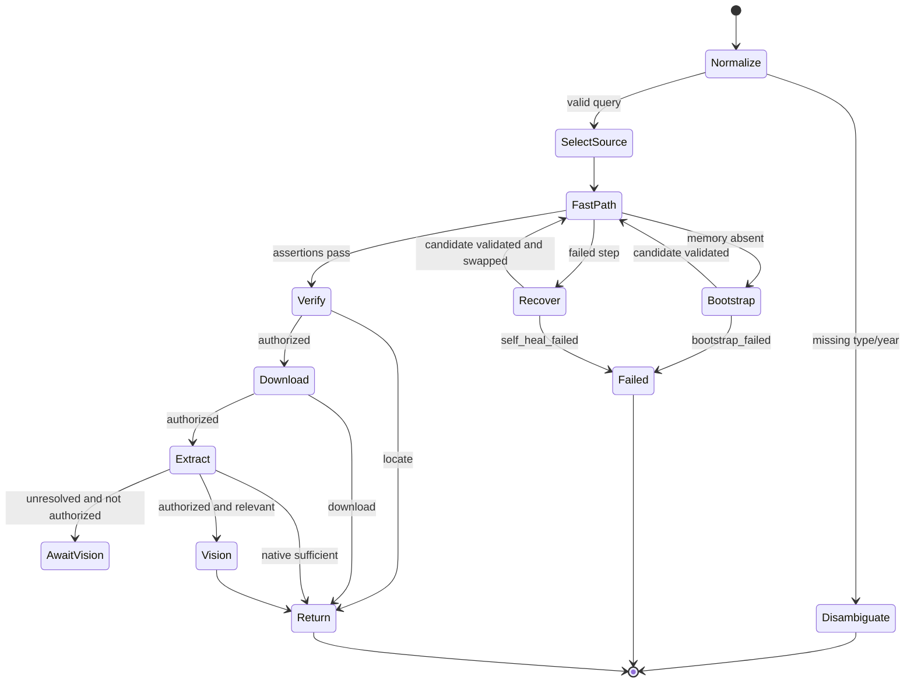

# Workflow and recovery

## Transport recovery

Start index/detail access with a fresh named browser session and retry browser launch once with a different name. Classify browser startup, navigation, timeout, final-URL, semantic-marker, and carrier failures separately. After a recorded browser page-access failure, fall back to ordinary HTTP and classify DNS, TLS, timeout, non-2xx, redirect, empty response, and invalid content type separately. If neither route validates the index, return `source_unavailable`; use `browser_unavailable` only when browser launch is terminal and page-level HTTP recovery is unavailable or cannot satisfy the task.

After agent-browser verifies a `document_url`, close the session and call `scripts/download_official_document.py` for authorized byte transfer. Classify its structured failures independently as URL scope, network, timeout, HTTP status, empty response, excessive size, content type/magic, or Artifact-store errors. Do not retry document transfer through the Chrome PDF viewer.

## Structure recovery

Prefer title text, URL containment, document suffix/type, and pagination labels. Provide recovery only the failed step and minimum relevant structure. Reject candidate memory that broadens URL permissions or loses an assertion.

## Cleanup

Close named sessions and remove task-temp directories after producing persisted authorized outputs. A cleanup failure is a warning and does not erase a successful result. Never remove or rebuild the Artifact root during upgrades or cleanup.
