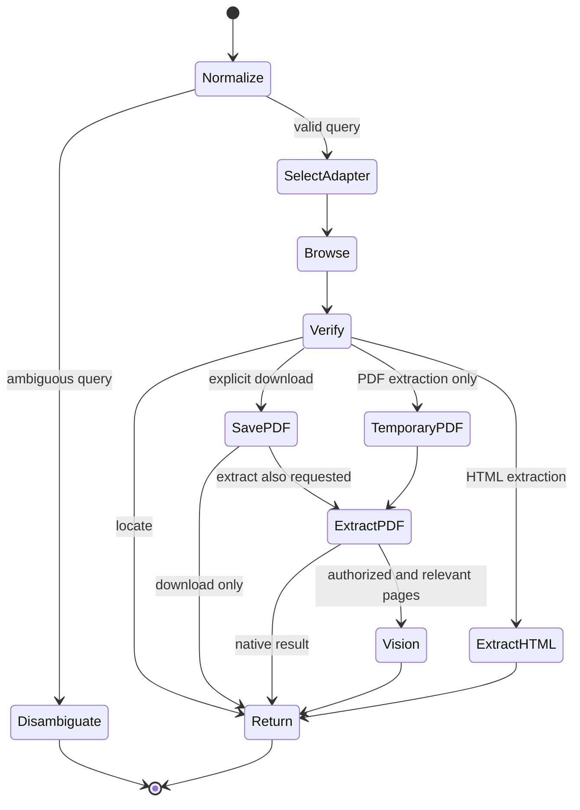

# Workflow

Start every query from the selected adapter. Browser state is task-local and is never persisted.

Use ordinary HTTP only after a concrete browser page-access failure. It must obey the same URL and content assertions and cannot expand adapter permissions.

Close named browser sessions and remove task-temporary PDFs and renders after success or failure. Cleanup failures become warnings and do not erase a successful result.
